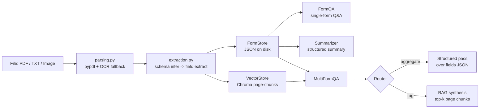

# Architecture

## Components

| Module | Responsibility |
| --- | --- |
| `parsing.py` | Route by extension; PDFs use pypdf, fall back to Tesseract OCR per-page below a char threshold. |
| `extraction.py` | LLM call #1 infers a `FieldSpec` schema; call #2 extracts each field with `{value, page, snippet, confidence}`. |
| `store.py` | `FormStore` (JSON files) + `VectorStore` (Chroma persistent client, page-level chunks). |
| `qa.py` | Single-form QA. Prompt includes extracted fields + raw text. Pydantic validates `{answer, citations, confidence}`. |
| `summarize.py` | Structured summary: TL;DR, parties, dates, amounts, obligations, risks, overall. |
| `multi_qa.py` | Router LLM picks `rag` (top-k page chunks) vs `aggregate` (compact field JSON). |
| `agent.py` | `FormAgent` facade. |
| `cli.py` | Click commands. |
| `ui/streamlit_app.py` | Optional UI. |

## Why two-pass extraction?

Schema inference makes the agent template-free: it discovers what *this* form contains rather than relying on a fixed list. The second pass then does the high-precision extraction with citations + confidence, so downstream consumers (UI, QA, summary) never have to re-read raw text for low-level facts.

## Why a router for cross-form questions?

Aggregational questions ("total of all expense reports", "how many applicants over 5 years") are best answered from the already-extracted structured fields — exact, cheap, and verifiable. Open-ended questions benefit from RAG over page chunks. The router lets one entry point (`ask_all`) handle both naturally.
